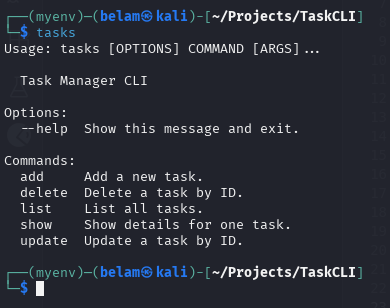

# Task Manager CLI

## Introduction

This is a lightweight **Task Manager CLI** built in Python using **SQLite** for storage.
It lets you manage tasks straight from your terminal — fast, simple, and distraction-free.

---

## Features

✨ What you can do:

* Create, list, update, and delete tasks (CRUD operations).
* View tasks in a clean, colorful terminal table (thanks to [Rich](https://rich.readthedocs.io/)).
* Easy to install and run anywhere with Python.

---

## Project Structure

```bash
|-- images/
|    -- tasks.png       # Screenshot showing available commands
|-- task_manager/
|    -- __init__.py
|    -- cli.py          # CLI entry point (Click commands)
|    -- commands.py     # Database logic (SQLite actions)
|-- tests/
|    -- __init__.py
|    -- test_db.py      # Unit tests
|-- .gitignore
|-- LICENSE
|-- README.md
|-- requirements.txt    # Dependencies
|-- setup.py            # Packaging & entry point (installs `tasks` command)
```

---

## Installation

Requirements:

* Python 3.7+
* pip

Steps:

1. Clone the repo:

   ```bash
   git clone https://github.com/bmuia/TaskCLI.git
   cd TaskCLI
   ```

2. Install dependencies:

   ```bash
   pip install -r requirements.txt
   ```

3. Install the CLI locally:

   ```bash
   pip install -e .
   ```

---

## Usage

Open your terminal inside the project root, then run:

```bash
tasks
```

You’ll see all available commands:



Examples:

```bash
tasks list      # show all tasks
tasks add       # add a new task (prompts for details)
tasks update    # update a task by ID
tasks show      # show details for one task
tasks delete    # delete a task by ID
```

---

## Troubleshooting

If something doesn’t work:

1. Make sure you’re inside a virtual environment (`python -m venv venv && source venv/bin/activate`).
2. Run `pip install -e .` again after changes.
3. Check that your SQLite database (`tests.db`) exists — the app should create it automatically.
4. Open an issue or email me at [belammuia0@gmail.com](mailto:belammuia0@gmail.com).

---

## Contributing

Got ideas? Found a bug?

* Open an issue
* Or make a pull request 🚀

---

## Resources

* [SQLite](https://www.sqlitetutorial.net/) – lightweight database
* [Rich](https://rich.readthedocs.io/) – pretty terminal output
* [Click](https://click.palletsprojects.com/) – command-line framework

---

## License

MIT License – see the [LICENSE](LICENSE) file for details.

---

## Closing Note

This project is meant to be **simple and practical** — a CLI to manage tasks without distractions.
If you like it, feel free to ⭐ the repo and extend it with new features!
